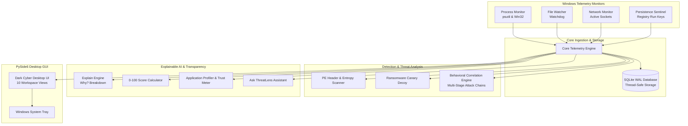

<div align="center">


# ThreatLens

### Personal Windows Security & Real-Time Transparency Platform

*Your computer. Your visibility. Your control.*

[](https://www.python.org/)
[](https://pypi.org/project/PySide6/)
[](https://www.microsoft.com/windows)
[](https://pytest.org/)
[](#privacy--security-guarantee)
[](LICENSE)

<p align="center">
  <a href="#-key-features">Key Features</a> •
  <a href="#-visual-preview--screenshots">Screenshots</a> •
  <a href="#-architecture--detection-subsystems">Architecture</a> •
  <a href="#-quick-start">Quick Start</a> •
  <a href="#-project-structure">Structure</a> •
  <a href="#-running-tests">Testing</a>
</p>

---

</div>

## 📌 What is ThreatLens?

Traditional antivirus software operates as a black box: it flashes an alert saying *"Threat blocked"* or stays silent, leaving users in the dark about what programs are doing behind the scenes.

**ThreatLens** bridges the gap between enterprise-grade endpoint telemetry and human understanding. It continuously observes Windows system activity—processes, files, registry keys, and network connections—and translates complex system events into plain, natural-language explanations.

Instead of cryptic logs like:
```text
powershell.exe -> CreateProcess -> cmd.exe (Parent PID: 4812, Flags: -enc...)
```
ThreatLens explains:
> **PowerShell started Command Prompt**  
> *Microsoft PowerShell launched Command Prompt with an encoded script parameter. Attackers frequently use encoded commands to evade simple string detection.*  
> **Risk:** High • **Action:** Flagged & Monitored • **Recommended Action:** Terminate process if unexpected.

---

## 📸 Visual Preview & Screenshots

> *Add your 3 screenshots into the [`assets/screenshots/`](assets/screenshots/) folder with the filenames below.*

### 1. Overview & Endpoint Health Posture
> *Real-time 0–100 Security Score, active protection shields, key endpoint telemetry, and quick security action shortcuts.*


---

### 2. Live Activity Timeline & "Why?" Contextual Breakdown
> *Real-time telemetry stream with instant natural-language translations, severity filters, and one-click 5-point explainability modals.*


---

### 3. Process Lineage Explorer & Threat Scanner
> *Interactive parent-child process tree visualizer, PE structural inspection, Shannon entropy analysis, and encrypted quarantine vault.*


---

## ✨ Key Features

| View / Module | Core Functionality | Human Transparency Impact |
|---|---|---|
| **🛡️ Overview & Health** | Dynamic 0–100 Endpoint Health Score with deduction factors. | Eliminates vague "Protected" badges by explaining exactly why points are deducted. |
| **⚡ Live Activity Stream** | Real-time event feed with search, severity filters, and pause control. | Converts low-level Windows APIs into plain-English event stories. |
| **🔍 "Why?" Security Engine** | Instant 5-point contextual breakdown for any system event. | Explains *What happened? Who caused it? Where? Why does it matter? Recommended action*. |
| **🌲 Process Hierarchy** | Interactive tree view showing parent-child process relationships. | Unmasks hidden child processes spawned by Office documents, browsers, or scripts. |
| **🌐 Network Sentinel** | Live TCP/UDP socket tracking (`psutil.net_connections`). | Translates technical IP/port numbers (e.g. `443`, `53`, `8080`) into plain-language services. |
| **⏱️ System Changes** | Audits Windows Registry `Run`/`RunOnce` keys and Startup folders. | Alerts immediately when an application registers itself to survive system reboots. |
| **🪤 Ransomware Decoys** | Deploys hidden canary files in sensitive folders (`.threatlens_canary.docx`). | Any attempt by ransomware to encrypt canary files triggers instant containment. |
| **📦 Application Profiler** | Tracks application behavioral habits over time with a 0–100% Trust Meter. | Flags anomalies when a trusted app suddenly performs unusual outbound connections. |
| **🔒 Scanner & Quarantine** | PE header checks (`pefile`), Shannon entropy analysis, and XOR vault. | Isolates malicious files safely with reversible one-click Restore or Delete. |
| **🤖 "Ask ThreatLens"** | Local, deterministic natural-language Q&A assistant. | Answers questions like *"What happened today?"* or *"Why is my computer slow?"* |
| **📑 Security Reports** | Daily/Weekly executive summaries with Markdown export. | Generates clear, readable audit reports for personal records or IT review. |

---

## 🔬 Architecture & Detection Subsystems

ThreatLens operates on a multi-tiered defense and explainability architecture:



### 1. Static PE & Entropy Inspection
- **Shannon Entropy Analysis**: Scans file byte distribution; scores $>7.4$ trigger packed/encrypted malware indicators.
- **PE Structural Parsing**: Uses `pefile` to parse PE headers, identify suspicious sections (`.upx`, `.vmp`), and detect dangerous imported API combinations (`VirtualAllocEx`, `WriteProcessMemory`, `CreateRemoteThread`).
- **Signature & Hash Blocklists**: Real-time cross-referencing against known threat hashes (SHA-256 / MD5).

### 2. Multi-Stage Behavioral Correlation
Catches complex advanced threats that evade single-event scanners by correlating actions across time:
$$\text{Download Event} \longrightarrow \text{Process Spawn} \longrightarrow \text{Startup Persistence} \longrightarrow \text{Outbound Network}$$
When these related events occur within a correlation window, ThreatLens synthesizes them into a unified **Critical Incident Alert**.

### 3. Ransomware Canary Tripwires
- Deploys hidden decoy canary files (`.threatlens_canary.docx`) containing unique byte patterns across user directories (`Desktop`, `Downloads`, `Documents`).
- Any modification, renaming, or encryption attempt immediately fires an emergency containment signal.

### 4. Zero-Knowledge Offline Transparency
- **100% Local Execution**: All heuristics, regex rules, profiling baselines, and Q&A parsing run entirely on your local machine.
- **No Telemetry Phoning Home**: Your private file paths, browsing sockets, and process names never leave your workstation.

---

## 🚀 Quick Start

### Prerequisites
- **Operating System**: Windows 10 or Windows 11 (64-bit)
- **Python**: Python 3.10, 3.11, or 3.12 installed ([Download Python](https://www.python.org/downloads/))

### Installation Steps

1. **Clone the repository:**
   ```powershell
   git clone https://github.com/stebyvarghese1/ThreatLens.git
   cd ThreatLens
   ```

2. **Create and activate a virtual environment:**
   ```powershell
   python -m venv .venv
   .\.venv\Scripts\Activate.ps1
   ```

3. **Install dependencies:**
   ```powershell
   pip install -r requirements.txt
   ```

4. **Launch ThreatLens Desktop:**
   ```powershell
   python -m app.main
   ```

---

## 🧪 Running Tests

ThreatLens includes a comprehensive test suite covering all telemetry monitors, PE static analysis, behavioral correlation, quarantine encryption, natural-language parsing, and GUI rendering:

```powershell
# Run the complete test suite
python -m pytest -v
```

Output:
```text
============================= test session starts =============================
platform win32 -- Python 3.12.8, pytest-9.1.1
collected 18 items

tests/test_assistant.py::test_assistant_intents PASSED                   [  5%]
tests/test_correlation.py::test_attack_chain_correlation PASSED          [ 11%]
tests/test_database.py::test_init_and_add_event PASSED                   [ 16%]
tests/test_database.py::test_add_events_batch PASSED                     [ 22%]
tests/test_database.py::test_upsert_process_and_status PASSED            [ 27%]
tests/test_database.py::test_alerts_and_resolution PASSED                [ 33%]
tests/test_gui_smoke.py::test_gui_initialization_and_views PASSED        [ 38%]
tests/test_gui_smoke.py::test_event_card_widget_instantiation PASSED     [ 44%]
tests/test_monitors.py::test_process_risk_heuristics PASSED              [ 50%]
tests/test_monitors.py::test_file_handler_ignore_patterns PASSED         [ 55%]
tests/test_network.py::test_port_descriptions PASSED                     [ 61%]
tests/test_quarantine.py::test_quarantine_and_restore PASSED             [ 66%]
tests/test_scanner.py::test_entropy_calculation PASSED                   [ 72%]
tests/test_scanner.py::test_known_hash_detection PASSED                  [ 77%]
tests/test_scanner.py::test_suspicious_payload_heuristics PASSED         [ 83%]
tests/test_scoring.py::test_explain_simple_summaries PASSED              [ 88%]
tests/test_scoring.py::test_explain_why_breakdown PASSED                 [ 94%]
tests/test_scoring.py::test_security_score_calculator PASSED             [100%]

============================= 18 passed in 3.01s ==============================
```

---

## 📁 Project Structure

```text
ThreatLens/
├── assets/                             # Visual media and screenshots
│   ├── logo.png                        # Official high-resolution ThreatLens emblem
│   └── screenshots/                    # Application UI showcase images
│       ├── screenshot-1.png            # Overview & Health Dashboard
│       ├── screenshot-2.png            # Live Activity & Why? Explanation
│       └── screenshot-3.png            # Process Tree & Security Scanner
├── app/
│   ├── config.py                       # Global configuration, weights, and directory paths
│   ├── main.py                         # Application bootstrapping entrypoint
│   ├── core/
│   │   ├── engine.py                   # Central telemetry hub linking all subsystems
│   │   ├── explain.py                  # Plain-language explanation engine & Why? generator
│   │   ├── scoring.py                  # Dynamic 0-100 Security Score calculation model
│   │   └── monitors/
│   │       ├── process_monitor.py      # psutil-based process hierarchy & command-line watcher
│   │       ├── file_monitor.py         # Watchdog file system event listener
│   │       ├── network_monitor.py      # TCP/UDP connection and port translation monitor
│   │       └── persistence_monitor.py  # Windows Registry Run/RunOnce sentinel
│   ├── detection/
│   │   ├── scanner.py                  # Static PE structural parser, Shannon entropy & hashes
│   │   ├── correlation.py              # Multi-stage behavioral attack chain correlation
│   │   └── ransomware.py               # Hidden canary decoy tripwire engine
│   ├── security/
│   │   ├── quarantine.py               # Reversible XOR encrypted quarantine vault
│   │   └── decisions.py                # User allowlist & decision memory persistence
│   ├── transparency/
│   │   ├── profiler.py                 # Application baseline habits & trust scoring
│   │   ├── assistant.py                # "Ask ThreatLens" deterministic Q&A engine
│   │   └── reports.py                  # Structured daily/weekly security report generator
│   ├── database/
│   │   ├── connection.py               # SQLite connection factory (WAL mode enabled)
│   │   ├── schema.sql                  # Database schema (events, alerts, profiles, network)
│   │   └── repository.py               # Thread-safe database access and query layer
│   └── gui/
│       ├── app.py                      # Application lifecycle & Windows system tray
│       ├── assets.py                   # Icon asset loader & Windows AppUserModelID registration
│       ├── main_window.py              # Navigation shell hosting all 10 views
│       ├── theme.py                    # Cyber-dark Qt stylesheet (QSS)
│       ├── widgets/
│       │   ├── score_gauge.py          # Radial security health gauge widget
│       │   └── event_card.py           # Dual-layer telemetry card with "Why?" dialog
│       └── views/
│           ├── dashboard_view.py       # Overview, health score, and active shields
│           ├── live_activity_view.py   # Streaming event feed with search & filters
│           ├── processes_view.py       # Process hierarchy tree & kill process tools
│           ├── network_view.py         # Socket connection table with port translation
│           ├── applications_view.py    # App profiles, trust meters, and habit baselines
│           ├── system_changes_view.py  # Registry and startup modifications audit
│           ├── security_view.py        # Threat scanner, shield toggles, and quarantine
│           ├── assistant_view.py       # Interactive natural language Q&A console
│           ├── reports_view.py         # Formatted daily audit reports and export
│           └── settings_view.py        # Log retention policies and scan paths
├── tests/                              # Automated test suite (18 unit/smoke tests)
├── requirements.txt                    # Project dependencies (PySide6, psutil, pefile, watchdog)
├── prd.md                              # Product Requirements Document
└── README.md                           # Documentation & user guide
```

---

## 🔒 Privacy & Security Guarantee

- **Zero Cloud Communication**: ThreatLens does not send telemetry, process lists, file names, or hashes to any external server.
- **Local SQLite Storage**: All event records, application profiles, and incident logs are stored locally in `data/threatlens.db` using WAL mode for maximum speed and data integrity.
- **Safe Quarantine**: Quarantined threats are encrypted using XOR byte-transformation with `.quar` extensions to prevent accidental execution by the operating system or user.

---

## 📄 License

This project is licensed under the MIT License — see the [LICENSE](LICENSE) file for details.

---

<div align="center">

**Developed with ❤️ for computer transparency and personal security.**  
GitHub: [@stebyvarghese1](https://github.com/stebyvarghese1) • Repository: [ThreatLens](https://github.com/stebyvarghese1/ThreatLens)

</div>
